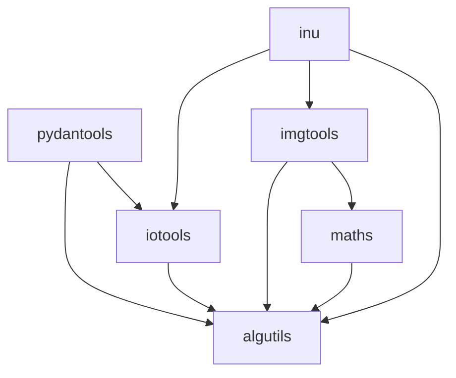

# algutils monorepo refactor (Stage I + II)

## Context from codebase review

- Current layout: [`algutils/pyproject.toml`](algutils/pyproject.toml) discovers packages under [`algutils/src/`](algutils/src/algutils/). Tests live under `src/algutils/tests/`, `src/algutils/io/tests/`, `src/algutils/param/tests/`, and `src/algutils/param/fixed_pydantic_yaml/test/`.
- Root [`conftest.py`](conftest.py) is **byte-for-byte identical** to [`algutils/src/algutils/conftest.py`](algutils/src/algutils/conftest.py) (fixture `multi_label_data_table` used by [`algutils/.../tests/test_pdtools.py`](algutils/src/algutils/tests/test_pdtools.py)). Root [`pyproject.toml`](pyproject.toml) pytest `testpaths` only include `datasets/tests` and `annotations/tests`, so the root `conftest` is effectively dead unless pytest is invoked with broader paths.
- **Coupling** (drives packaging order):
  - [`algutils/io/camera.py`](algutils/src/algutils/io/camera.py) uses [`algutils/math/geom`](algutils/src/algutils/math/geom/) (`Vec2d`, `Pose`) and `algutils.param.TBox`, `units`. **Plan:** move **`camera.py` into `imgtools`**, so **`imgtools` depends on `maths`** for geometry—not `iotools`.
  - [`algutils/io/`](algutils/src/algutils/io/) otherwise imports `algutils` core: `events` (`Timer`), `param.TBox`, `units`, `binary`, `short`, `regexp`, `wrap`, etc.
  - [`algutils/param/models.py`](algutils/src/algutils/param/models.py) imports [`algutils/io/format.py`](algutils/src/algutils/io/format.py) and other `algutils` internals.
  - [`algutils/events.py`](algutils/src/algutils/events.py) and [`algutils/filesproc.py`](algutils/src/algutils/filesproc.py) use **lazy** `from .io import imsave` / `from .io.imread import imread` inside functions (no top-level `io` imports elsewhere in core).
  - [`algutils/math/hist.py`](algutils/src/algutils/math/hist.py) imports `algutils` (`as_list`, `datatools`).

**Chosen I/O Python package name:** `iotools` (repository path [`toolbox/io/`](toolbox/io/) or similar; **do not** use top-level package name `io` — conflicts with the standard library).

**Inuitive / NU4 helpers:** Today [`algutils/io/imread.py`](algutils/src/algutils/io/imread.py) mixes generic `imread` with Inuitive-specific APIs (`imread_disp_nu4`, `imread_depth_nu4`, `_nu4_tiff_tags`, `tiff_inu_cam`, `imread_stereo`, `imread_stereo_nu4`, `imread_fly3d`, `save_depth_nu4`, `save_disp_nu4`). After extraction, **`iotools.imread` stays generic**; product-specific pieces live under **`inu.utils.imread`** (see §4b). [`algutils/io/imwrite.py`](algutils/src/algutils/io/imwrite.py) currently **duplicates** `save_depth_nu4` / `save_disp_nu4`—during implementation, **deduplicate** by delegating to `inu` (or a sibling `inu.utils.imwrite`) so behavior stays single-sourced.

---

## Stage I — Directory and module moves

### 1) Tests + `conftest.py`

- Create [`algutils/tests/`](algutils/tests/) at the **algutils project root** (next to `src/`, not inside `src/algutils/`).
- Move:
  - `src/algutils/tests/` → `algutils/tests/` (rename layout only; preserve package-relative asset paths if any).
  - `src/algutils/io/tests/` → e.g. `algutils/tests/io/` (or `tests/iotools/` if you mirror the new package name).
  - `src/algutils/param/tests/` → `algutils/tests/param/`.
- **fixed_pydantic_yaml tests** move with code to `pydantools` (see §6), not under `algutils/tests/`.
- Tests that cover **Inuitive** helpers (`test_imread_stereo`, etc.) should move with the **`inu`** package test tree (or stay next to `iotools` tests if only generic `imread` remains there).
- **`conftest.py`**: keep a **single** [`algutils/tests/conftest.py`](algutils/tests/conftest.py) with the shared fixtures; delete [`algutils/src/algutils/conftest.py`](algutils/src/algutils/conftest.py). For the duplicate root [`conftest.py`](conftest.py): remove or replace with a comment pointing to `algutils/tests/conftest.py` so pytest does not maintain two copies.
- Update [`algutils/pyproject.toml`](algutils/pyproject.toml) `[tool.pytest.ini_options]` `testpaths` from `["src/algutils"]` to `["tests"]` (and optionally `norecursedirs` / markers if needed).

### 2) `math` → `toolbox/maths/`

- New installable package directory e.g. [`maths/`](maths/) with `pyproject.toml`, `README`, `src/maths/` (or chosen layout).
- Move [`algutils/src/algutils/math/`](algutils/src/algutils/math/) into `maths/src/maths/` (adjust imports from `algutils.math` → `maths`).
- [`algutils/math/hist.py`](algutils/src/algutils/math/hist.py) depends on `algutils.datatools` / `algutils` — **`maths` should declare `algutils` as a dependency** (acceptable one-way edge unless you later slim `hist`).

### 3) `image` + **`camera`** → `toolbox/imgtools/`

- New package [`imgtools/`](imgtools/) with `src/imgtools/`.
- Move [`algutils/src/algutils/image/`](algutils/src/algutils/image/) there; update imports (`algutils.image` → `imgtools`).
- Move **[`algutils/io/camera.py`](algutils/src/algutils/io/camera.py)** into **`imgtools`** (e.g. `imgtools/camera.py`). Update imports: `from maths.geom import Vec2d, Pose` (or equivalent), `from algutils.param import TBox`, `units`, etc.
- **`imgtools` depends on `maths`** (geometry for camera) and **`algutils`** (TBox, units, strings, etc.). Optional/lazy use of **`iotools`** only where needed (e.g. if camera still calls into TIFF metadata helpers that remain in `iotools`—prefer pushing **`tiff_inu_cam`** into `inu` and having camera call `inu` to avoid cycles; see §4b).
- [`image/tools.py`](algutils/src/algutils/image/tools.py) previously lazy-imported `StereoCam` from io → becomes **`from imgtools.camera import StereoCam`** (same package).

### 4) `io` → `toolbox/io/` with package name `iotools` (**no `maths` dependency**)

- New package under e.g. [`io/`](io/) (folder name per your spec) with **`pyproject.toml` project name** like `iotools`.
- Move [`algutils/src/algutils/io/`](algutils/src/algutils/io/) to `io/src/iotools/`, **excluding**:
  - **`camera.py`** (moved to `imgtools`, §3).
  - Inuitive-specific symbols removed from `imread.py` per §4b (keep generic `imread` / `SUPPORT_*` / shared helpers in `iotools`).
- **`iotools` `install_requires` must not include `maths`.** Internal imports remain **`iotools` depends on `algutils`** (`events`, `param`, `units`, `binary`, …).
- **Lazy imports** in `algutils` that referenced `.io` must target `iotools` (e.g. `from iotools import imsave`) to avoid keeping a duplicate `algutils.io` tree.

### 4b) `inu` package — [`toolbox/inu/utils/imread.py`](inu/utils/imread.py)

- Add a new installable package **[`inu/`](inu/)** (repository root sibling to `algutils`, `maths`, …) with `pyproject.toml` and package layout **`inu.utils`** (Python import path: `from inu.utils.imread import …`).
- **Extract** from current [`imread.py`](algutils/src/algutils/io/imread.py) into **`inu/utils/imread.py`**:
  - Every **function / variable whose name contains `nu4` or `inu`** (e.g. `imread_disp_nu4`, `imread_depth_nu4`, `_nu4_tiff_tags`, `tiff_inu_cam`, `save_depth_nu4`, `save_disp_nu4` if defined in this module).
  - **`imread_stereo`**, alias **`imread_stereo_nu4`**, and **`imread_fly3d`**.
- **Dependencies (expected):** `inu` depends on **`iotools`** (generic `imread` and shared I/O utilities), **`imgtools`** (`StereoCam` after camera move), and **`algutils`** (`TBox`, etc. as today). This keeps **`iotools` free of `maths`** while still allowing stereo/Inuitive flows.
- **Call-site updates:** e.g. [`datacast/transtools.py`](datacast/src/datacast/transtools.py) today does `from algutils.io.imread import imread, …, imread_stereo` → split to `iotools` + `inu.utils.imread` (or re-export `imread_stereo` from a small `inu` facade). [`basic_formats.py`](algutils/src/algutils/io/basic_formats.py) imports `imread_stereo` / `tiff_inu_cam`—point at **`inu`** after refactor.
- **`camera.py` → imgtools:** [`StereoCam.from_tiff`](algutils/src/algutils/io/camera.py) today imports `tiff_inu_cam` from `.imread`; after extraction, import from **`inu.utils.imread`** (acceptable **`imgtools` → inu** dependency, or optional extra—pick one and document).

### 6) `param/models.py` + `fixed_pydantic_yaml` → `toolbox/pydantools/`

- New package [`pydantools/`](pydantools/) with `src/pydantools/`.
- Move [`models.py`](algutils/src/algutils/param/models.py) and the whole [`fixed_pydantic_yaml/`](algutils/src/algutils/param/fixed_pydantic_yaml/) tree (including its `test/` suite → `pydantools/tests/`).
- Update imports in moved code:
  - `..io.format` → `iotools.format` ( **`pydantools` depends on `iotools` + `algutils`** ; `tbox` stays in `algutils.param` per your scope).
- [`algutils/param/__init__.py`](algutils/src/algutils/param/__init__.py) should re-export `YamlModel` / `model_arguments` from `pydantools` so existing `from algutils.param import YamlModel` keeps working during migration (thin facade).

---

## Stage II — Independent installable packages + tests

### Dependency direction (avoid pip cycles; **no `iotools` → `maths`**)

Target DAG:

- **`iotools` must not** depend on **`maths`** (explicit user constraint). Geometry-heavy **`camera`** lives in **`imgtools`**, which **does** depend on **`maths`**.
- **`algutils` must not** declare a hard `install_requires` on `iotools` if `iotools` already requires `algutils` (creates a **pip cycle**). Preferred pattern:
  - **`iotools`**: `install_requires = ["algutils", …]` **without** `maths`.
  - **`algutils`**: no `iotools` in core `install_requires`; document optional stacks (Pixi adds editable paths).
  - Replace remaining `from .io` lazy imports in `algutils` with `import iotools` inside functions.

Consumers that need Inuitive stereo helpers install **`inu`** (which pulls `iotools` + `imgtools` + `algutils` transitively as configured).

### Workspace / meta-package wiring

- Extend [`pyproject.toml`](pyproject.toml) `[tool.pixi.pypi-dependencies]` (and/or root optional deps) with editable path entries for `maths`, `imgtools`, `iotools`, `pydantools`, **`inu`** alongside existing packages.
- Update [`algutils/pyproject.toml`](algutils/pyproject.toml): optional extras previously `[io]`, `[image]`, `[math]` should map to dependencies on `iotools`, `imgtools`, `maths` instead of bundling those modules inside algutils; add an optional **`inu`** extra if you want a one-shot “stereo / NU4” stack.

### Import sweep (representative files)

- [`datacast`](datacast/src/datacast/transforms.py), [`datacast/collect.py`](datacast/src/datacast/collect.py), [`datacast/transtools.py`](datacast/src/datacast/transtools.py): `algutils.io` → `iotools` / `inu.utils` as appropriate; `algutils.image` → `imgtools`.
- [`vis`](vis/src/algovis/imageviewer.py), [`vis/src/algovis/view3d.py`](vis/src/algovis/view3d.py): same.
- [`engines/register.py`](engines/register.py), [`resman/src/resman/resource.py`](resman/src/resman/resource.py): `YamlModel` via `algutils.param` facade or direct `pydantools`.

### Tests

- Run **per-package** pytest from each new project root (`algutils`, `maths`, `iotools`, `imgtools`, `pydantools`, **`inu`**) after updating `testpaths`.
- Run **integration** pytest for `datacast`, `resman`, `vis` with updated deps.
- Optionally add a short **root-level** script or Pixi task `test-all` that runs these in dependency order.

### Docs / misc

- Update root [`__init__.py`](__init__.py) docstring (currently claims image/math live inside `algutils`).
- Update [`algutils/filesproc.py`](algutils/src/algutils/filesproc.py) `package_folder('algutils.io')` → something accurate for `iotools` if still used.

---

## Risk notes

- **High churn**: many cross-repo imports; use a scripted rename (e.g. `rg` + codemod) and run tests frequently.
- **`inu` placement**: confirm packaging for `inu.utils` (namespace vs flat) matches how [`inu`](inu/) is consumed across `datacast`, `imgtools`, and tests.
- **`imwrite` NU4 duplicates**: align `save_*_nu4` between `imread` extraction and [`imwrite.py`](algutils/src/algutils/io/imwrite.py) so NU4 save/load stay consistent.
