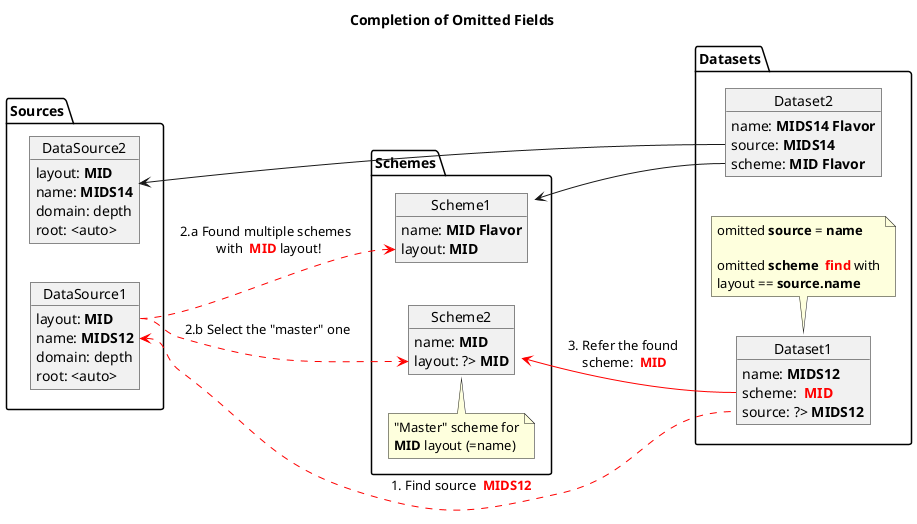

# Data Management Resources

------------------------
## Introduction
Data management resources described here are implemented using a generic
*Resource Management* package ``inu.resman``
(see description of it [main concepts](../../resman/docs/concepts.md)).

They are integral part of the ``inu.datacast`` framework and consist of
4 subclasses of ``inu.resman.ResourceModel`` defined in ``inu.datacast.models``:
- `DataSourceRM`
- `SchemeRM`
- `DatasetRM`
- `CollectionRM`

(*Here `RM` suffix denotes their `ResourceModel` inheritance.*)

Those models are compositionally related:

```plantuml
abstract class pydantc.BaseModel
abstract class inu.param.YamlModel
abstract class inu.resman.ResourceModel

metaclass inu.datacast.models.DataSourceRM
metaclass inu.datacast.models.SchemeRM
metaclass inu.datacast.models.DatasetRM
metaclass inu.datacast.models.CollectionRM

BaseModel <|-l- YamlModel
YamlModel <|-r- ResourceModel

ResourceModel <|-- DataSourceRM
ResourceModel <|-- SchemeRM
ResourceModel <|-- DatasetRM
ResourceModel  <|-- CollectionRM

DataSourceRM "1" o-- DatasetRM
SchemeRM "1" o-- DatasetRM

DatasetRM "n" o-- CollectionRM

DatasetRM -l-> inu.datacast.DataCaster
CollectionRM -l-> inu.datacast.DataCollection
```

`DataSourceRM` and `SchemeRM` may be considered as an auxiliary models.
Tey are constructed to ultimately create `DatasetRM` or `CollectionRM` instances required
to initialize two corresponding ``inu.datacats`` instruments: `DataCaster`and `DataCollection`.
(*see documentation on the [data casting](data_casting.md) for details*)

### Name References
Data resources heavily relay on the cross-referencing capabilities of ``resman`` package.
Name can be used in place of an aggregated resource to construct a composite resource.

For example, dataset can be initialized using only source and scheme names:

```python
ds = DatasetRM(source='MIDS12', scheme='MID')
```

In fully initialized form the aggregating resource contains fully initialized instances of sub-resources.
But input of the initialization may include *names of registered* resource as well as their content.

> This *smart* initialization mechanism is implemented using ``pydantic`` validators.

Accessing resource by name requires its prior *discovery* and *registration* by its
corresponding *resource manager*.

Resource discovery can be initiated either explicitly,
or *automatically* when reference by name is encountered.

### Defaults and Shortcuts

Some resources (as described below for specific cases) support initialization
with some omitted attributes deduced according to certain specified rules.

That helps to avoid excessive verbosity and over-formalization when defining
data processing flows, eliminates necessity of creation of unnecessary resource files.

For example, creation of `DataCollection`
 - requires specifying a`CollectionRM`, which in ist order,
 - consist of one or more datasets (`DatasetRM`)
 - each requiring specification of `SchemeRM` and `DataSourceRM`:

```python
from inu.datacast import DataCollection
from inu.datacast.models import *

dc = DataCollection(
    CollectionRM(
        datasets=[
            DatasetRM(
                source=DataSourceRM('KITTI'),
                scheme=SchemeRM('KITTI')
            )
        ]
    )
)
# Same can be achieved with:
dc = DataCollection('KITTI')
```
Here initialization follows this chain of deductions:

- `DataCollection` expects collection with name "KITTI"
  - There is NO collection with name "KITTI"
    - Minimal collection requires single dataset
    - No dataset with name "KITTI"
      - Minimal dataset requires both source AND scheme
      - Found source "KITTI" and found scheme "KITTI"
    - On the fly construct a dataset from found source and scheme
  - On the fly construct a collection from created dataset
- Provide created collection to ``DataCollection`` constructor.

>  - Every resource class implements its own simple deduction
>    rules using pydantic validators.
>  - Deduction chain emerges automatically from initialization
>    of nested resources by every resource class.


-------------------------------------------------------------

## Data Source
### Description
Folders with data organized according to certain rules (*layout*).
**Layout** identifies a particular set of files naming and arrangement
conventions used by this data source.

### Resource Model

> **name**:         ``DataSourceRM`` <br>
> **pattern**:
>   1. ``datasource.yml``      (in data root folder)
>   2. ``{name}.src.yml``       (in resource folder)   <br>
>
>  **location**: <br>
>   1. *root folder of this data source* <br>
>   2. `{RESOURCES}/datasources`

#### Attributes
```yaml
layout:     str     # [opt] unique name for this data source layout
root:       folder  # filled automatically as the ``data_source.yml`` folder
...                     # other domain specific attributes
domain:     [str]   # [opt] one or more applicative domains represented by the data
synthetic:  [bool]  # [opt] indicator that data is synthetic
realism:    enum    # [opt] Level of realism of the synthetic data, True for the real.
```

#### Defaults
```yaml
name: name ⇒ root_last_part   # root=/my/data/src ⇒ src
layout: layout ⇒ name

if file_name.suffix == datasource.yml:
    root: ⇒ file_folder  # ERROR if root is given explicitly!
else:
    root: root ⇒ ERROR   # root must be given explicitly!
```

#### Constructors
```python
from inu.datacast.models import DataSourceRM

DataSourceRM(name='SourceName',  root='/source/folder')           # 2. config from arguments
DataSourceRM('SourceName', root='/source/folder')                 # same
DataSourceRM('SourceName')    # Query config                      # 3. config from query


DataSourceRM.parse_file('/path/to/datasource.yml')                 # 4. config from yaml file
DataSourceRM(root='/source/folder')                               # same as 2 - no

```

### Used By
 - `Scheme` resources (implements parsing for the data source of this `layout`)
 - `Dataset` resources
------------------------
## Casting Scheme
### Description
Set of instructions how to **cast** a data source folder of certain layout into
the *Universal Labeled Data* (**ULD**) form.

### Resource Model
> **name**:         ``SchemeRM``   <br>
> **pattern**:      ``{name}.scm.yml`` <br>
> **location**:     ``{RESOURCES}/schemes`` <br>

#### Attributes
```yaml
pattern:    str       # regular expression or custom files naming template
layout:     str       # [optional] unique name for this data source layout
...
# other scheme attributes (see Scheme DSL specifications)
```

#### Defaults
```yaml
name: name ⇒ file_name
layout: layout ⇒ name  # layout == name makes it the "master" scheme!
search: search ⇒ pattern
```

### Used By
 - `DataSetRM` resources (attribute: `scheme`)
 - `DataCollection` (can be created during initialization)

----------------------------------
## Dataset
### Description

Basic collection of data items from a <u>single</u> *datasource*
cast using specific *scheme* with optional *filtering*.

### Resource Model
> **name**:         ``DatasetRM``<br>
> **pattern**:      ``{name}.ds.yml``<br>
> **location**:     ``{RESOURCES}/datasets``<br>

#### Attributes
```yaml
source:      DataSourceRM   # data source to cast
scheme:      Scheme         # casting scheme compatible with the source layout
filters:     dict           # see Caster Spec
transforms:  dict           # data transforms
...
# other scheme attributes (see Scheme DSL specifications)
```

#### Defaults:
```yaml
name: name ⇒ file_name ⇒ source.name ⇒ scheme.name ⇒ ERROR
source: source ⇒ FIND DataSourceRM of same name ⇒ scheme.name ⇒ ERROR
scheme: scheme ⇒ FIND Scheme of same name
               ⇒ FIND (ONLY OR Master) Scheme with layout as source.layout
               ⇒ ERROR
```
-----------------------
## Data Collection
### Description
Collection of samples from multiple `Datasers` with optional additional filtering.

### Resource Model
> **name**:         ``CollectionRM``<br>
> **pattern**:      ``{name}.col.yml``<br>
> **location**:     ``{RESOURCES}/collections``<br>

#### Attributes
```yaml
datasets:  [DatasetRM]  # list of datasets contributing to this collection
label_datasets: bool    # add `dataset` label to every item pointing to its source
query: str              # query to filter the items after collecting
bundle: [str]           # optionally overrides composed bundle from all the datasets
description: str        # describes intention or content of this data collection
```

#### Defaults
```yaml
name: name ⇒ file_name
datasets: datasets ⇒ [name] FIND Dataset with name ⇒ ERROR
label_datasets: True
```

### Used By
 - `DataCollection` class initialization

-------------------------------

Learn more abouts resources [usage scenarios](../../resman/docs/use_cases.md).

# Examples

### Explicit and default attributes.



