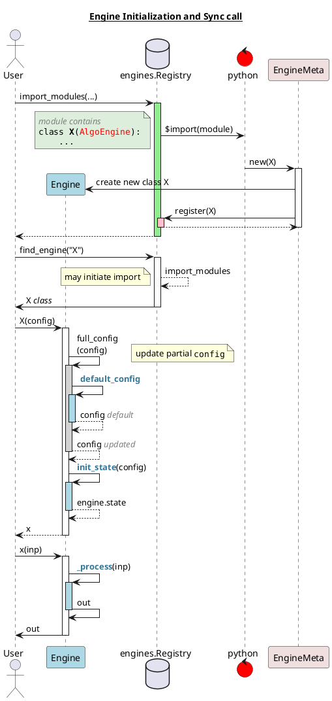
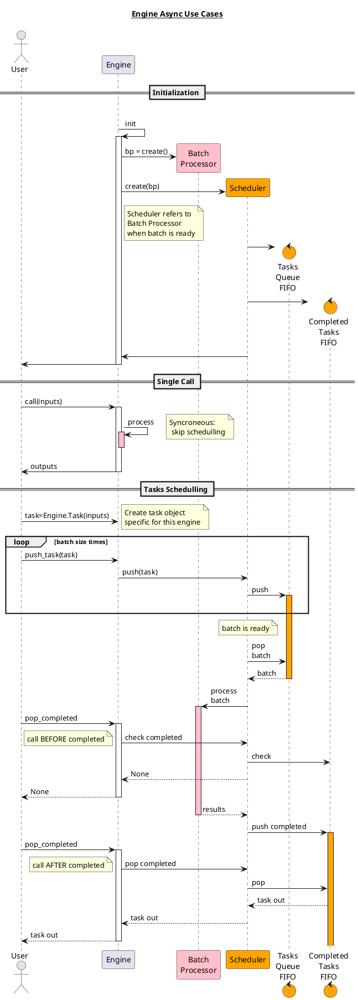

#OK

```plantuml
@startuml

title: __**Engine Initialization and Sync call**__

!unquoted function $virt($f)
!return "<color #357899>**" + $f +"**</color>"
!endfunction

!unquoted function $com($s)
!return "<color #grey>//" + $s +"//</color>"
!endfunction

actor User as U
participant Engine as E #lightblue
database engines.Registry as R
control python as pi  #red
participant EngineMeta as EM  #efdfdf

U -> R ++ #lightgreen: import_modules(...)
R -> pi: $import(module)
note left #ddeedd
    $com(module contains)
    ""class **X**(<color #red>AlgoEngine</color>):""
    ""    ...""
end note

pi -> EM ++: new(X)
EM -> E **: create new class X
EM -> R ++ #pink: register(X)
R --> EM --
EM --
R --> U --

U -> R ++: find_engine("X")
R --> R: import_modules
note left: may initiate import
R -> U--: X //class//

U -> E ++: X(config)
E -> E ++ #lightgrey: full_config\n(config)
note right : update partial ""config""
E -> E ++ #lightblue: $virt(default_config)

return config $com(default)
return config $com(updated)
E -> E++ #lightblue: $virt(init_state)(config)

return engine.state
return x

U -> E++: x(inp)
E -> E++ #lightblue: $virt(_process)(inp)

E -> E--: out
E -> U--: out

@enduml
```

```plantuml
@startuml
title __**Engine Async Use Cases**__

actor User as U
participant Engine as E
participant "Batch\nProcessor" as B #pink
participant Scheduler as S #orange
control "Tasks\nQueue\nFIFO" as Q  #orange
control "Completed\nTasks\nFIFO" as C  #orange

== Initialization ==
    |||
    E -> E ++: init
    E -> B **: bp = create()
    E -> S **: create(bp)
    note right E: Scheduler refers to \nBatch Processor \nwhen batch is ready
    S -> Q **
    S -> C **

    S -> E
    S --
    E -> U --

== Single Call ==
    U -> E ++: call(inputs)
    E -> E++ #pink: process
    E --
    note right: Syncroneous:\n skip schedulling
    E -> U --: outputs

== Tasks Schedulling ==

    U -> E: task=Engine.Task(inputs)
    note right: Create task object \nspecific for this engine
    loop batch size times
        U -> E: push_task(task)
        E -> S: push(task)
        S -> Q ++ #orange: push

        |||
    end

    note over S: batch is ready
    S -> Q: pop \nbatch
    return batch

    S -> B ++ #pink: process\nbatch

    U -> E ++: pop_completed
    E -> S  : check completed
    note left: call BEFORE completed

    S -> C: check
    S --> E --: None
    S --
    E --> U --: None

    B --> S --: results
    S -> C ++ #orange: push completed

    U -> E ++: pop_completed
    E -> S: pop completed
    note left: call AFTER completed
    S -> C: pop

    C --> S: task out

    S --> E: task out
    return task out

@enduml
```

```puml
@startuml
actor User as U
participant Engine as E
participant Scheduler as S #orange
control "Tasks\nQueue\nFIFO" as Q  #orange
control "Completed\nTasks\nFIFO" as C  #orange

== Initialization ==
U -> E**: Scheduler
note right: initialized with //**Scheduler** __class__//
E -> S**: engine
note right: initialized with\n//**Engine** __instance__//
'eng.scheduler = Scheduler(\nsingle_processor = eng._process,\nbatch_processor = eng._process_batcj)

note across #e6e0bd: Process Single Task
U -> E++ #pink: _call_
E -> E++ #red: _process(task)
return outputs
return outputs


note across #e6e0bd: Multi Tasks Processing Iterator


U -> E++: process_iter(tasks)
E -> S**: create(batch_size, tasks)
E --> U: iterator

U -> E: next
E -> C: pull
alt #e0ffe0 Has Completed
C --> E: task
else #ffe7ef No Completed
loop while tasks AND Q.size < batch_size
E -> Q++: push
end
Q o-\ E--: batch queue
E -> E++ #red: _process_batch(queue)
E --> E--: completed batch\n tasks

loop while tasks AND Q.size < batch_size
E -> C: push
end
E -> C: pull
C --> E: task
end
E --> U: task
destroy E


U -> E++ #7adaff: process_iter(tasks):
E --> U: iterator
note right: Iterator over completed tasks
loop
U -> E++  #2a8aff: next

loop until pop completed task
E -> S: push(task)
E -> S: pop
S --> E: task
end
alt task is None
E -> S: flush
note over E, S: Force to process all the queue
E -> S: pop
S --> E: task
end
E --> U--: task
end
destroy E
|||


'================== Batching Modes ===========================
note across #e6e0bd: ** Support for Batching **

U -> E: batch_mode()
return batch_size
note right
    **Query current batch mode**
    ____
    **False** for not supported
    **0** for disabled
    **positive integer** for batch size
end note
...
U -> E: batch_mode(True)
return batch_size | False
note right
    returns batch_size = **False** if engine
    does not support batch processing
end note
...
U -> E: batch_mode(False)
E --> U: 0 | False
U -> E: batch_mode()
return 0
note right: Batch Size 0 indicates no batching
...
'================ Scheduling =======================
'-----------------------------------
note across #f0c080: ** Scheduler Based Services  **

note across #b0d0d0: Single Mode Tasks
U -> E: pop
return None
note right: No completed tasks

U -> E: push(task <color red>**A**</color>)
U -> E: push(task <color green>**B**</color>)
...
U -> E: pop
return task <color red>**A**</color>
...
U -> E: push(task <color blue>**C**</color>)
U -> E: pop
return task <color green>**B**</color>

U -> E: pop
return task <color blue>**C**</color>

U -> E: pop
return None

'------------------------------------
note across #b0d0d0: Batch Mode Tasks

U -> E++: pop()
return
U -> E

U -> E++: process_iter(tasks)

U -> E ++ #darkred: pop
E -> S ++: pop
S -> C: pop
C --> S: None
S --> E --: None
return None
note right: No completed tasks
...
'=================  Big Push =================
U -> E++ #lightpink: push(task)
E -> S++: push(task)
S -> Q: push(task)

alt Execution Condition Satisfied
|||
    else Single Task
        S -> Q: pop
        Q --> S: task
        S -> E++ #red: _process(task)
        E --> S--: task + outputs
        S -> C: push(task)
        ...
        |||
    else Batch Mode
        loop __BATCH_SIZE__ of tasks
            S -> Q: pop
            Q --> S: task
        end
        S -> E ++ #red: _process_batch\n(**tasks**)
        E --> S--: tasks (with outputs)
        loop __BATCH_SIZE__ of tasks
            S -> C: push(task)
        end

end
|||
E--
|||


U -> E ++ : push(task)
E -> E ++ #pink: _call_(task)

U -> E ++ #darkred: pop
E -> C: pop
C --> E: None
return None
note right: still processing, Nothing to return

E --> E--: out
E -> C ++: push(task.out = out)
E --

U -> E ++ #darkred: pop
E -> C: pop
C --> E--: task
return task
note right: first (and only) completed task

newpage
note across #e0e0e0: Enabled Batch Mode


U -> E: push(task)


@enduml
```
