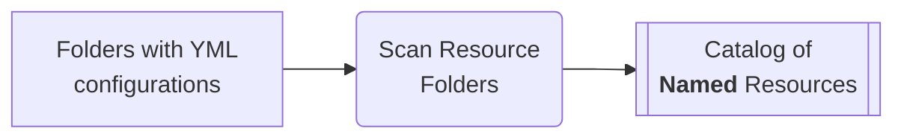

#  Catalogs of Configuration Resources

## Problem Statement
This document describes our approach to the framework-wide
configuration management.

It is based on several observations about our **typical workflows**:
1. Configurations must be _accessible_ from the code and directly
2. Configurations are _reusable_ and require a retention mechanism
3. Some configurations may _refer_ to other configurations.
4. Access to a configuration by some _descriptive name_
5. We often deal with multiple slight variations of same configuration
6. Early verification of _correctness_ in the code and editor is required
7. Configurations correctness depends on the version of code which uses it
8. We need to list, review and query available configurations

## Design Decisions
1. Keep configurations as `.yml` files
2. Use secondary suffixes (like `.scm.yml`) to differentiate between configuration types
3. Stable **default locations** for the _configurations tree_ under version control
4. Automatic catalog building by browsing and parsing configurations tree

