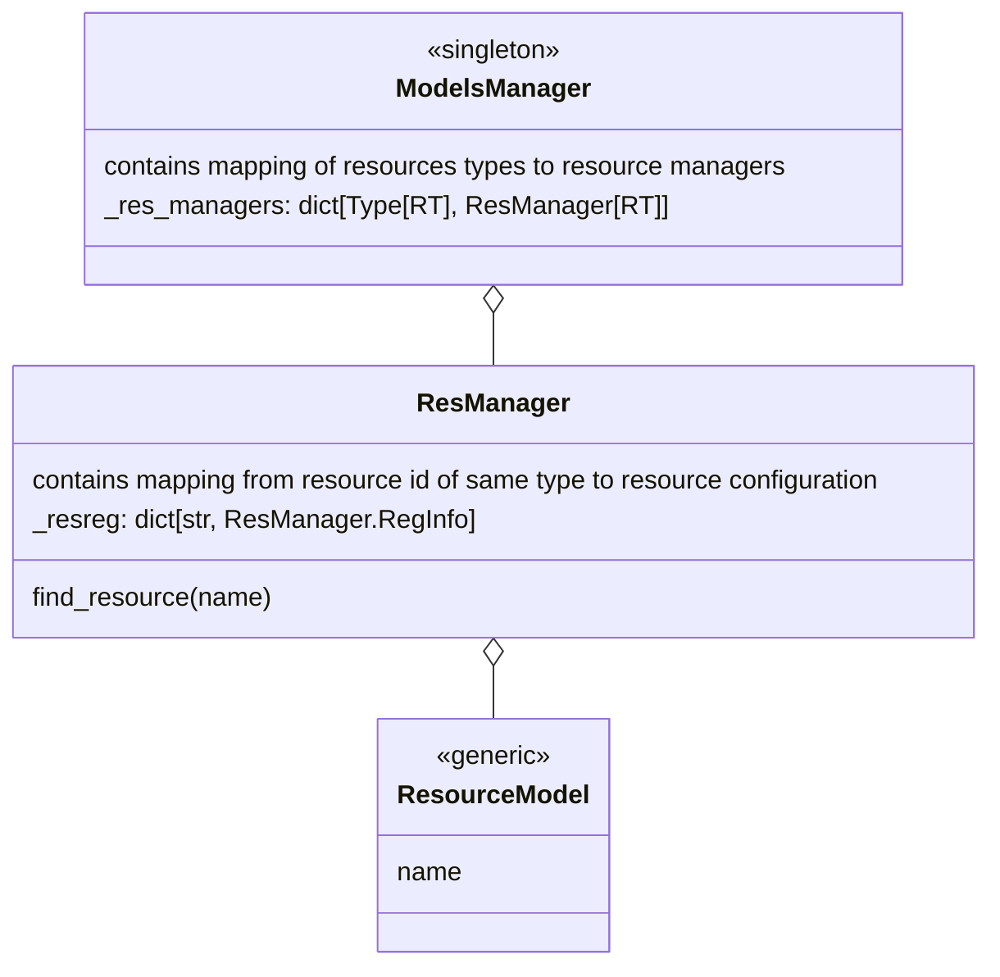
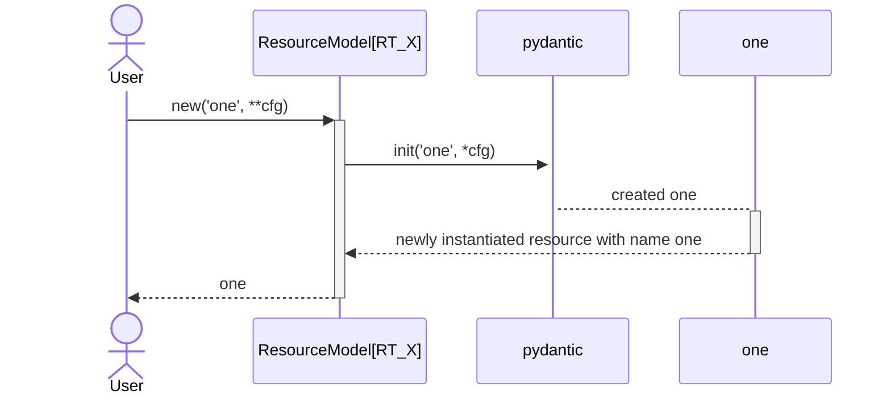
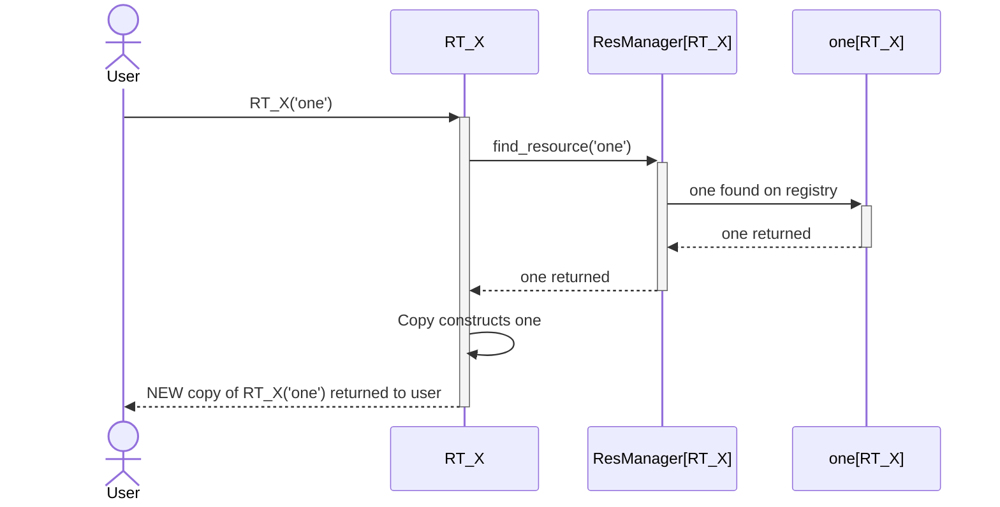
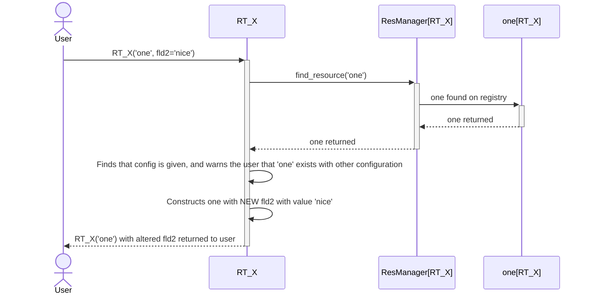
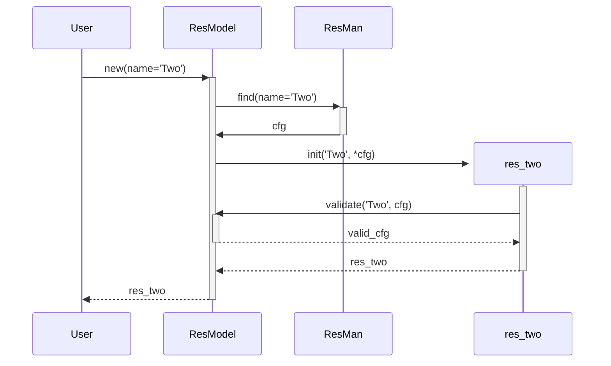
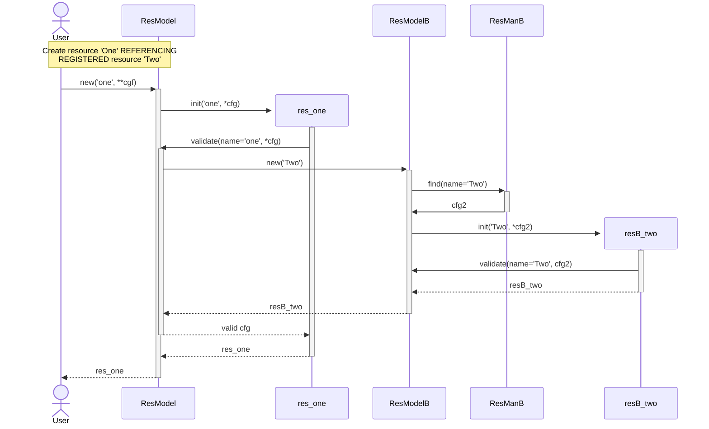
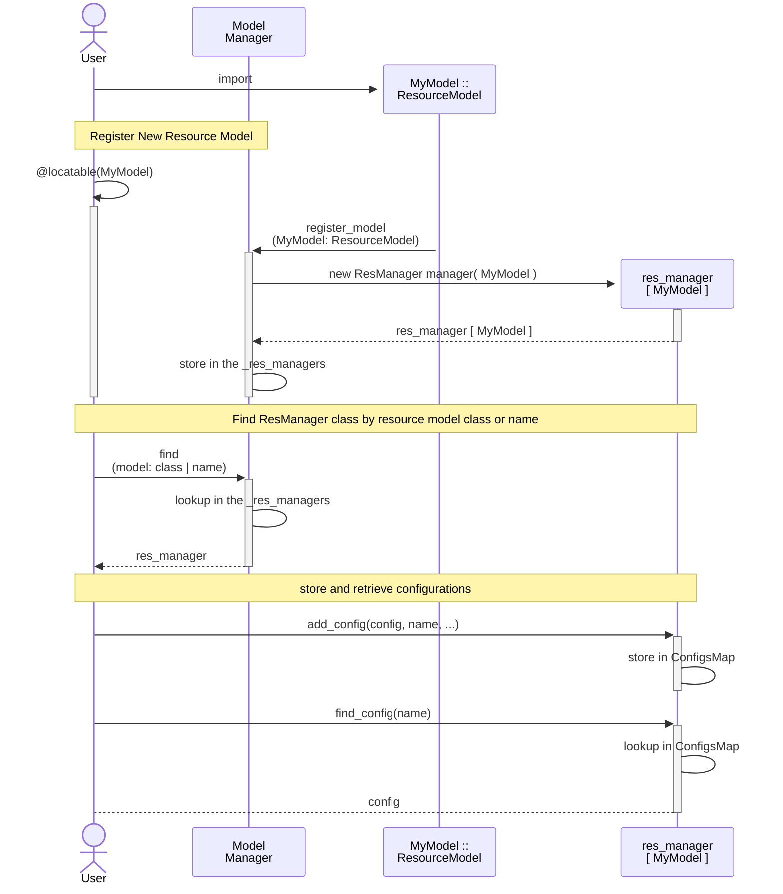

# Resources Management Framework

This framework provides basic tools to manage different kinds of generic _resources_.

Resource management is orthogonal to the meaning and usage of the resources.
It provides logistic services for their classifications, registrations, locations.

## Main Concepts and Components

Resource
: Entity defined as hierarchy of attributes, represented by (usually) YAML files,
  thus also referred as _configurations_.

Resource Model
: Semantic and syntactic structure of a particular _kind_ of
  resource is defined by the corresponding `pydantic` model.

YamlModel
: Subclass of `pydantic.Model` used as a base to implement `Resource Models`.

Configurations Manager
: Instances of a `ResManager` class managing configurations of one particular kind of
  resources identified by its `YamlModel`.

Models Manager
: A SW component managing the multiplicity of `Resource Models`.

### Compound Resources and Names

Being a hierarchy of attributes a resource may contain other resources:

- explicitly as sub-nodes
- implicitly by referencing

Resource referencing mechanism is based on their _names_,
which thus must be _unique_ in the context of particular resource kind,
(ensured by the corresponding `ResManager`).

Since the resource configuration semantic is controlled by its `pydantic` model,
providing a string for a node defined as a `ResourceModel` type,

## Class Diagram




## Use Cases

### Creation of Resource

#### Create Unregistered Resource
```python
from inu.resman.resource import ResourceModel

class RT_X(ResourceModel):
  fld1: str
  fld2: str

RT_X('one', fld1='nice', fld2='very nice')
```


---
#### Create Registered Resources

##### Without configuration
```python
from inu.resman.resource import ResourceModel

class RT_X(ResourceModel):
  fld1: str

RT_X('one')
```

##### With configuration
```python
from inu.resman.resource import ResourceModel

class RT_X(ResourceModel):
  fld1: str

RT_X('one', fld2='nice')
```


# FixMe: THIS diagram

[//]: # (```mermaid)

[//]: # (sequenceDiagram)

[//]: # (    actor User)

[//]: # (    participant ResMan)

[//]: # (    participant ResModel)

[//]: # (    participant Files)

[//]: # ()
[//]: # (    Note over User, File: Discover Resources Configurations)

[//]: # (        User ->>+ ResMan: discover&#40;ResModel&#41;)

[//]: # (            ResMan ->> +Files: search)

[//]: # (            Files ->>- ResMan: file_name)

[//]: # (    )
[//]: # (            ResMan ->> +ResModel: parse_file_to_dict&#40;file&#41;)

[//]: # (            ResModel ->> -ResMan: cfg)

[//]: # (    )
[//]: # (            ResMan ->> +ResModel: get_name&#40;cfg&#41;)

[//]: # (            ResModel ->> -ResMan: name = 'Two')

[//]: # (    )
[//]: # (            ResMan ->> ResMan: register&#40;name: &#40;file, cfg&#41;&#41;)

[//]: # (        ResMan ->> -User:)

[//]: # (    )
[//]: # (    Note over User, ResModel: Query Model - Unknown)

[//]: # (        User ->> +ResModel: ??? get&#40;name='One'&#41;)

[//]: # (            ResModel ->> +ResMan: find&#40;name='One'&#41;)

[//]: # (            ResMan ->> -ResModel: None)

[//]: # (        ResModel ->>-User: None)

[//]: # ()
[//]: # (```)

#### Query Registered Resource By Name

````python
r = ResModel('Two')
````



#### Create Unregistered Resources Referencing Registered Resources

```python
from inu.resman import ResourceModel, ModelsManager, locatable

# Definition of the resources
@locatable('my/resources')
class ResModelB(ResourceModel):
    ...

class ResModel(ResourceModel):
    b: ResModelB
    ...

# Working with resources
ModelsManager.discover()   # discovers ResModelB('Two)
res_one = ResModel('one', b='Two', )
```

This scenario combines that of [Creation of Resource](#creation-of-resource)
and of [Query Registered Resource By Name](#query-registered-resource-by-name)



### Main Use Cases


